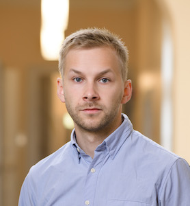

# [About me](/about)

I am an astrophysicist focusing on topics like cosmic plasmas, high-energy astrophysical phenomena, and computational physics.
I've also done some research on computer sciences, statistics, and machine learning.
For my research I use tools such as pen & paper and supercomputers.

Currently, I have a joint position as a Postdoctoral Research Scientist in [Columbia University](https://physics.columbia.edu/) and as a Flatiron Research Fellow in [Center for Computational Astrophysics, Flatiron Institute](https://www.simonsfoundation.org/flatiron/center-for-computational-astrophysics/) (New York, USA).
Previously, I was a Nordita Fellow in [Nordic Institute for Theoretical Physics](http://www.nordita.org) (Stockholm, Sweden). 
I am also an avid open-source science & software advocate --- you can find my research and codes freely available from [GitHub](https://github.com/natj).

### [Research](/articles)

I have a wide range of interdisciplinary research interests. These reflect some of my latest publications:

- **High-energy astrophysics**: accretion (accretion disks); compact objects (neutron stars, black holes)
- **Plasma physics**: collisionless plasma dynamics; turbulence; particle acceleration

- **Nuclear physics**: equation of state of cold ultra-dense neutron matter
- **General relativity**: ray tracing
- **Statistics**: Bayesian inference; Monte Carlo methods

- **Computer sciences**: high performance computing; parallellization paradigms; machine learning; Julia language
- **Mathematics**: cellular automata models; topology

 <!-- /.inforow -->

---

<h4 style="margin-top: 0.2em; margin-bottom: 0.0em;"> Notes on physics</h4>

- [Relativistic plasma physics](https://github.com/natj/notes-corpus/blob/master/plasma-physics/notes.pdf)
- [MHD turbulence](https://github.com/natj/notes-corpus/blob/master/turbulence/notes.pdf)
- [Digital filtering](https://github.com/natj/notes-corpus/blob/master/filtering/notes.pdf)
- [Introduction to neutron stars](https://github.com/natj/thesis) (my PhD thesis)

Most of these research notes are done in connection to some publication. If you want to cite these, let me know and I'll point you to a right paper.

#### [Teaching](/teaching)

- [CSC High-performance Summer School](https://www.csc.fi/en/web/training/-/csc_summerschool_2019)
    - latest materials from [2019](https://github.com/csc-training/summerschool)
- [Introduction to Julia](https://github.com/csc-training/julia-introduction) (CSC)
- [Introduction to UNIX](https://github.com/natj/unix-intro) (Univ. Turku)
- [Scientific writing tips](https://github.com/natj/sci_writing)

<h4 style="margin-top: 0.2em; margin-bottom: 0.0em;"> Undergraduate/PhD collaborators</h4>

- Tuomo Salmi (host for Nordita PhD visit; MSc and BSc thesis co-supervisor)
- Maarja Kruuse (host for Nordita PhD visit)
- John Hope (MSc thesis supervisor)
- [Jere Kuuttila](https://www.mpa-garching.mpg.de/person/54672/2377) (MSc thesis co-supervisor)
- Eemeli Annala (PhD collaboration)

<h4 style="margin-top: 0.2em; margin-bottom: 0.0em;"> Senior collaborators </h4>

- Pavel Abolmasov (Univ. Turku)
- [Axel Brandenburg](https://www.nordita.org/~brandenb/) (Nordita)
- [Andrei Beloborodov](https://physics.columbia.edu/people/profile/398) (Columbia Univ.)
- [Tyler Gorda](http://www.phys.virginia.edu/People/personal.asp?UID=tdg5cs) (Univ. Virginia)
- Jari Kajava (Univ. Turku)
- [Aleksi Kurkela](https://th-dep.web.cern.ch/roster/kurkela-aleksi) (CERN)
- [Cole Miller](https://www.astro.umd.edu/~miller/) (Univ. Maryland)
- [Farrukh Nauman](https://fnauman.github.io/) (Chalmers U.)
- [Pauli Pihajoki](https://blogs.helsinki.fi/pihajoki/) (Univ. Helsinki)
- [Juri Poutanen](http://users.utu.fi/jurpou/) (Univ. Turku)
- [Lorenzo Sironi](http://user.astro.columbia.edu/~lsironi/Site/Home.html) (Columbia Univ.)
- [Andrew Steiner](http://neutronstars.utk.edu/) (Univ. Tennessee & ORNL)
- Valery Suleimanov (Univ. Tubingen)
- [Aleksi Vuorinen](https://www.mv.helsinki.fi/home/arjvuori/) (Univ. Helsinki)
- Alexandra Veledina (Nordita & Univ. Turku)

 <!-- /.inforow -->

## Recent publications & blog posts


   	
	
   


<!-- /.tiles -->

#### For more posts see [publications](/articles) and [other posts](/projects).

